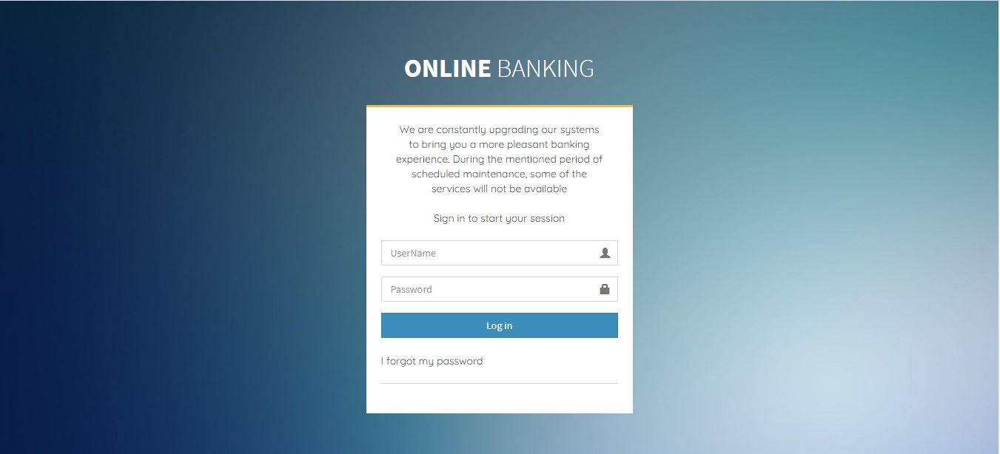
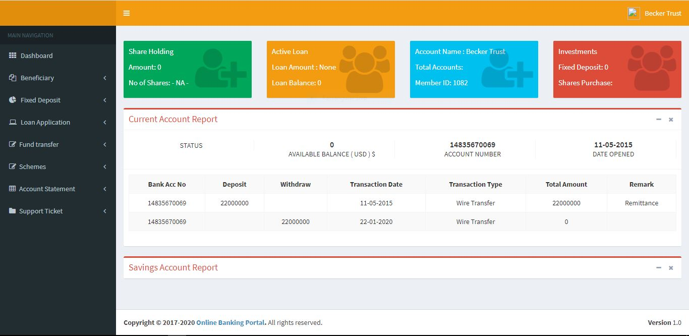

# Ulsteraim Dashboard

<div>
    
    
</div>
<br>

> This project is a copy of a bank account dashboard feature I built for Ulsteraim bank.<br/>
This project only shows the dashboard feature and its interactions but not the entire Ulsteraim website.

## See Live
⚠️ This is not a link to create an account with Ulsteraim <br>
Click [HERE](https://ulsteraim.netlify.app/sign_in/logged_in.html) to interact live with the project.

## Built With:
 - Pure HTML
 - Pure CSS
 - Vanilla JavaScript

## Features
1: Profile page
2: Overview of account
3: Support Ticketting


## Cloning the project
```
git clone  [Link](https://github.com/i-max-xi/Ulsteraim_Dashboard.git)
```

## Deploy local
```
npm start
```

## Getting packages and debuging with Stylelint
```
npm install --save-dev stylelint@13.x stylelint-scss@3.x stylelint-config-standard@21.x stylelint-csstree-validator@1.x
```
##### For validation detection using Stylelint Run
```
npx stylelint "**/*.{css,scss}"
```
##### from parent source directory

## Getting packages and debuging with ESlint
```
npm install npm install --save-dev eslint@7.x eslint-config-airbnb-base@14.x eslint-plugin-import@2.x babel-eslint@10.x
```
##### For validation detection using Stylelint Run
```
npx eslint .
```
##### from parent source directory

## Getting packages and debuging with Webhint
```
npm init -y
npm install --save-dev hint@6.x
```
##### For validation detection using Webhint Run
```
npx hint .
```

 ## 🤝 Contributing

Feel free to check the [issues page](https://github.com/i-max-xi/Ulsteraim_Dashboard/issues).

## Show your support

Give a ⭐️ if you like this project!

## Author

Maxwell <br>
[github](https://github.com/i-max-xi)

## 📝 License

This project is [MIT](./MIT.md) licensed.
